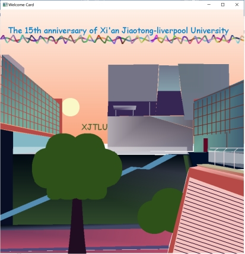
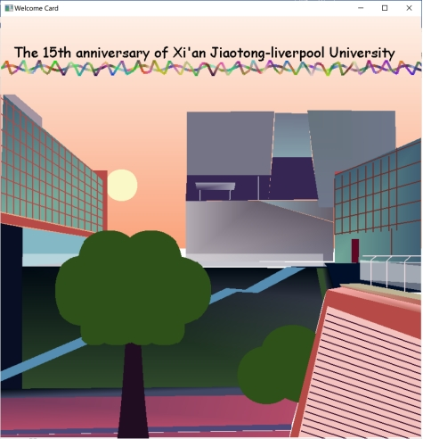
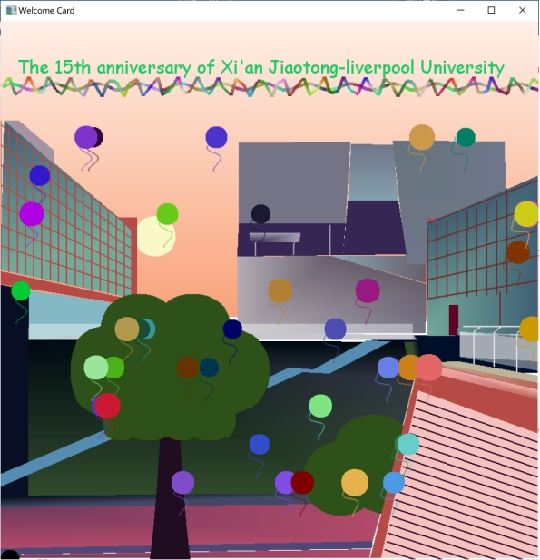
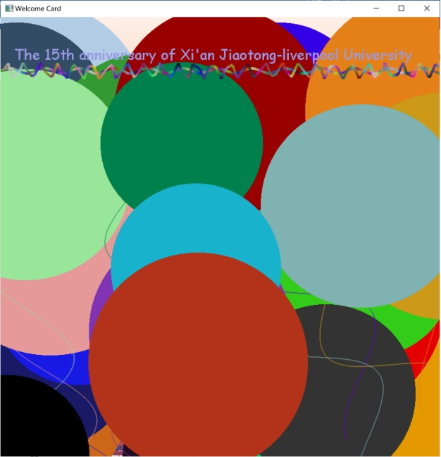

# 2D Modelling Project – Greeting Card of 15th anniversary of XJTLU

### 1、Introduction

The 2-dimensional Greeting Card is made to celebrate the 15th anniversary of XJTLU. The card is mainly made of a beautiful capture of the school at dusk as well as flying balloons and greeting titles. The balloons are controlled by keyboard input and can be quite large to show a strong festive atmosphere. Besides, the greeting words and balloons can flash in different colors, which is controlled by the mouse. This report will discuss the features of the card in detail and clarify the interactive part to better run the program with some typical screenshots to show the program intuitively.

### 2、Graphic Features

##### 2.1 Building

The building is looking from the Mathematics Building to the Central Building at dusk. The picture contains the library as one of the landmark buildings of XJTLU, Science Building with the floors and one corner of the Public Building. The building is drawn with graphics primitives such as lines, triangles and polygons and then fill in color in smooth shading in local space. Then it was translated by translation and scaling to be placed in the world space. After translating by view matrix, projection matrix and viewport transform, it finally shows intuitively and recognizably.

##### 2.2 Scenery

The background presents a gradient effect using smooth shading and the setting sun is sheltered by buildings. The trees and thick growth of grass decorated the school. The standard ellipses are translated to the proper location to compose trees’ leaves and the grass and the root of the tree is composed by two parabolas. The sun is also drawn by using ellipse with the major axis equaling minor axis in length.

##### 2.3 Greeting words

The greeting words show on the top of the picture with some decorated lights made by two sin functions. When clicking the left mouse, the color of the greeting words as well as the decorations will change their colors. On the contrary, when clicking the right mouse, the greeting words will stay the same color. Apart from that, as long as you click the mouse, there will be a colorful “XJTLU” text shown where the mouse is located.

##### 2.4 balloons

The balloons are made up of ellipses and the rope tied to the balloon is drawn by the sin function. A number of balloons are made random size and ropes are rotated a certain angle within a certain range. The colorful balloons will fly from the bottom half of the screen and flying up util out of sight. The action of the balloons including the size of the balloons, direction and speed of the flying state, start and stop the flying are all controlled by keyboard input.

### 3. Interactive Section

##### 3.1 Mouse control

There also set some mouse control to add the interactivity of the card. 

1. When clicking the left mouse, the greeting words becomes colorful and the decorated lights will change color.

 

2. When clicking the right mouse, the greeting words stop changing color and stay black.

 

3. At the moment you click the mouse, there will a “XJTLU” text show where your mouse locates.

##### 3.2 Keyboard control

Some keyboard control are set to control the state of balloons.

1. “Q” or “q”: Exit the program.

2. “B” or “b”: Show static balloons

3. “K” or “k”: Disappear static balloons and the greeting words and decorated lights stop to shining frequently.

4. “B” or “b”: make balloons to move and the greeting words and decorated lights begin to shining frequently.

5. “M” or “m”: speed up the balloons.

6. “N” or “n”: slow down the balloons.

7. “S” or “s”: shrink balloons.

8. “E” or “e”: enlarge the balloons.

9. “L” or “l”: move balloons to the left.

10. “U” or “u”: move balloons up.

11. “R” or “r”: move balloons to the right.

12. “D” or “d”: move balloons down.

The following screenshots show the balloons moving picture and the picture in which balloons are enlarged by several times respectively, which show great festival atmosphere and great fun to celebrate the 15th anniversary of Xi’an Jiaotong-liverpool University.

 

 